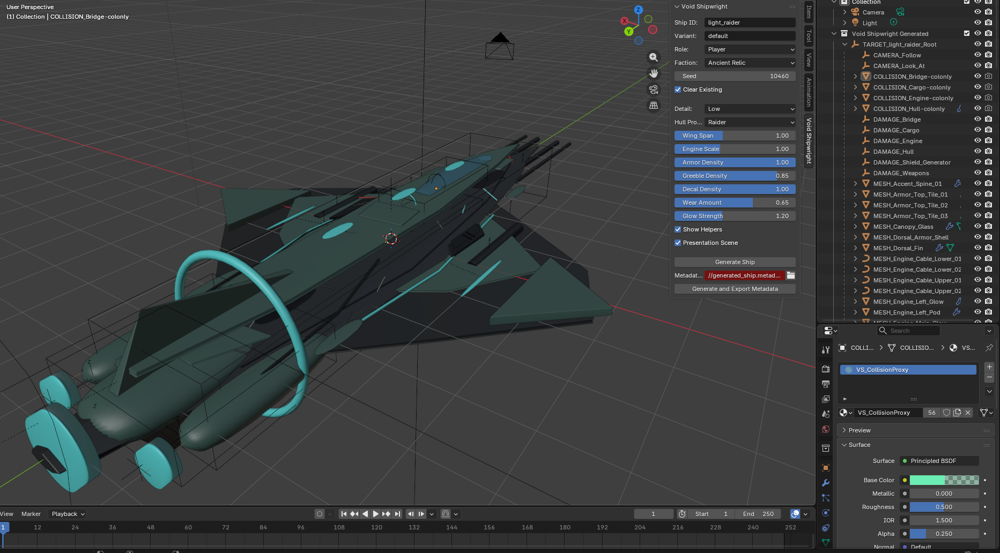

# Blender Spaceship Generator

## Made By OpenAI Chatgpts Codex AI Assistence

This repository contains the first pass of the `Void Shipwright` pipeline:

## Sample

- A modular Blender 4 add-on in `void_shipwright/`.
- A Godot 4 editor helper in `godot/addons/void_shipwright_importer/`.
- A JSON metadata contract in `schemas/ship_metadata.schema.json`.
- Example generated metadata in `examples/generated/void_ship_example.metadata.json`.

Read `AGENTS.md` first, then the docs in `docs/codex/` before changing generation behavior.
